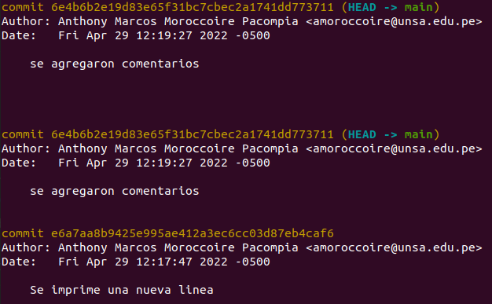
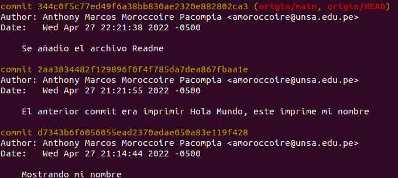

<h1 align=center>Programacion Web 2 Laboratorio 1 Practica Individual</h1>
<h3 align=left>DOCENTE</h3>

Richart Smith Escobedo Quispe (rescobedoq@unsa.edu.pe)

<h3 align=left>FECHA</h3>

29/04/22

<h3 align=left>NOMBRES</h3>

Anthony Marcos

<h3 align=left>APELLIDOS</h3>

Moroccoire Pacompia

<h3 align=left>OBJETIVOS</h3>
<ul>
    <li>Aprender a manejar un sistema de control de versiones</li>
</ul>
<h3 align=left>TEMAS</h3>
<ul>
    <li>Git</li>
    <li>GitHub</li>
</ul>
<h3>CREACION DE LA CUENTA GITHUB</h3>
<ol>
    <li>Se ha seguido los pasos de la guia del laboratorio</li>
    <li>Creacion del repositorio</li>
    <li>Generacion de un token</li>
    <li>
        Para el trabajo se usaron los siguientes comandos
        <ul>
            <li>git init</li>
            <li>git config --global user.email</li>
            <li>git config --global user.name</li>
            <li>git add</li>
            <li>git commit -m "un comentario" </li>
            <li>git remote add origin <i>link del repositorio</i></li>
            <li>git push -u origin main</li>
        </ul>
    </li>
</ol>
<h3>MUESTRA DE LOS COMMITS</h3>
<ol>
    <li></li>
    <li></li>
</ol>

